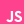

<!--Credits: 
readme typing animation: https://github.com/DenverCoder1/readme-typing-svg
readme stats: https://github.com/anuraghazra/github-readme-stats
readme streak stats: https://github.com/DenverCoder1/github-readme-streak-stats
readme activity graph: https://github.com/ashutosh00710/github-readme-activity-graph
readme stats (small repo cards) : https://github.com/DenverCoder1/github-readme-stats
-->

<!-- <h3 align="centre"> 
  Hi There!!!
  
</h3> -->

<!--  -->

   
<!--     -->

<h3>
Connect with me:  
  

 
 
  
Programming Languages I work with:  

<!--  -->

<!--  -->
<!---->

<!--  -->
<!--  -->

 
 
  
<!--<a href="https://stackshare.io/aaryarajoju/all-tools"><a/>-->
Technologies/Tools I use:  

<!--  -->
<!--  -->
<!--  -->

<!--  -->
<!--  -->

</h3>

 
 
 

---

   
   
  

---

---

<!--

 
  
  
  
  
  
   
-->
  
<!--
  
  
  
  
  
   
-->
<!--   
  
  
   
-->

---

<!-- <b>Note:</b> All the stats are of my public code and they don't reflect experience or skill level. -->

<!--
Here are some ideas to get you started:
- 🔭 I’m currently working on ...
- 🌱 I’m currently learning ...
- 👯 I’m looking to collaborate on ...
- 🤔 I’m looking for help with ...
- 💬 Ask me about ...
- 📫 How to reach me: ...
- 😄 Pronouns: ...
- ⚡ Fun fact: ...
-->
